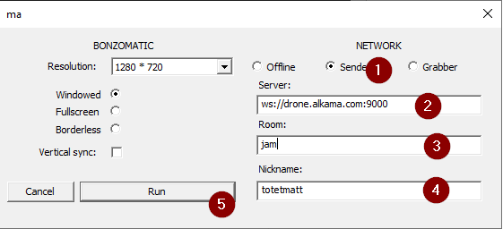
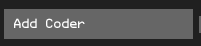
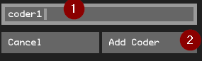
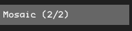
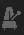

# Bonzomatic Launcher
Bonzomatic launcher is a utility tool for Bonzomatic Network to help to manage multiple Bonzomatic instance using the network feature.

# Installation
- We need first a network compatible version of Bonzomatic. Download one of theses version and unzip it in a directory that will be your "host" directory.
    - [https://github.com/TheNuSan/Bonzomatic/releases/download/v13/Bonzo_Network_13_x64.zip](https://github.com/TheNuSan/Bonzomatic/releases/download/v13/Bonzo_Network_13_x64.zip)
    - [https://github.com/wrightwriter/Bonzomatic-Compute](https://github.com/wrightwriter/Bonzomatic-Compute)
      
- Download [Extra_Launcher_08.zip](https://github.com/TheNuSan/Bonzomatic/releases/download/v13/Extra_Launcher_08.zip) here https://github.com/TheNuSan/Bonzomatic/releases/tag/v13 and unzip the content into your host directory previously created with the bonzomatic binaries inside.

- The directory should looks like this

  
# Configuration

The configuration is in `launcher.json` , open it and edit it to change behaviour of the launcher. Important settings are :

- `bonzo > exename `  : Ensure the name of the executable is the same for bonzomatic in your directory 

- `network > serverUrl` : Needs to be configurded to point to a bonzomatic network room like: `ws:\/\/drone.alkama.com:9000\/your_room_name\/`

# Interface
- Run `Launcher.exe`, you should see this interface
  


1 - Add Coder Manually

2 - Save change to `launcher.json` (listof coder  and other change done)

3 - Connect to Server

4 - Display Advanced participant option

5 - Diaporama mode and configuration

6 - Mosaic Mode

7 - Random Mode
  
When you start the Launcher without special change on the config, the interface is empty and without any coder list.

# Add Coder
## Automatic Detection
The easiest way to add coder is to use the automatic coder detection feature. 
First of all, you need to agree between all participant to a common network room. eg. ws://drone.alkama.com:9000/jam/:  
- Participants will configure bonzomatic as `sender` to `ws://drone.alkama.com:9000/jam/coder_name`
  

- On your side the `launcher.json` should have the parameter `serverURL` set to`ws:\/\/drone.alkama.com:9000\/jam\/`.

- On launcher interface, click on the icon  to connect to server.
- If it's properly connected, you should see the icon turning green 
- When participant will connect , you should see them appears on the list of participants
  
  

- Click on icon  next to the participant handle to confirm it and start displaying it.
## Add Coder Manually
### From UI
- Click on the button "Add Coder" 
- Enter the coder handle in the prompt and click on to confirm it.
  
  
### From Configuration
If you know in advance the list of participant and their handle, you can pre configure it on the `Launcher.json` by editing the list `coders` 
``` 
"coders": [
    "coder1",
    "coder2",
    "coder3"
  ],
```
The launcher will read this list only at startup.

# Monitoring


When the participant is with a green mark, it means the launcher receive properly the shader from the remote participant.
When the participant is with a red mark, it means the launcher doesn't receive properly the shader from the remote participant.
# Basic Display
## Mosaic
Mosaic mode will display all participants in a grid. 
Click on the button  to activate it.
## Focus
You can select one particular participant to display full screen by clicking on its handle.


## Random
Random will just pick a random participant to focus.
Click on the button to display a new random participant.
## Diaporama


1 - Activate Diaporama Mode

2 - Tap to measure bpm

3 - Reduce 1 BPM

4 - Increase 1 BPM

5 - Loop when finish

6 - Randomize

Diaporama Mode will generate a "playlist" of participant to play. The change between all participant will be done automatically and the timing can be tweak using the `Tap to measure bpm` button  or via Decrease / Increase button for BPM .

By default, the Diaporama mode will stop and come back to Mosaic mode after focusing all participants. If you want to loop indefinitvely you need to activate the loop via the button  .

By default, the Diaporama mode will follow the order of participant in the list. You can randomize the selection by clicking 
## Mute Participant
You can decide to hide participant using the icon  next to the participant handle you want to mute.
When muted, the icon is in red  and won't appears in the Mosaic or in Random mode. It can still be clicked and shown for focus.

# Advanced Participant Options 
When cliking to the button  you will display the Advanced Participant Options that will appears for each participants


1 - Mute participant

2 - Move participant to top of the list

3 - Move participant to bottom of the list

4 - Recycle participant instance. This will restart a fresh instance of bonzomatic for this participant. Use this in case of crash of if the participant bonzomatic windows is behaving not as expected.

5 - Remove participant from list. This will also close the bonzomatic instance for this participant
# Key bind

M: Show mosaic mode

D: Launch a diaporama

O: Toggle displaying options

R: Put a random coder in full screen

A: Add a new coder

[0-9]: coders 1-10 in full screen

ctrl+[0-9]: coders 11-20 in full screen

shift+[0-9]: coders 21-30 in full screen

alt+[0-9]: coders 31-40 in full screen

Left/right: show previous/next coder in full screen

F11: toggle shader overlay on all bonzo windows
