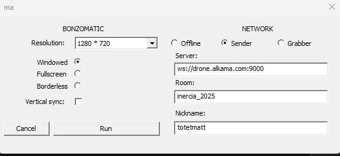

# Inércia 2025 Shader Jam

Here are the step to participate to the Inércia 2025 Shader Jam

## Download binary

* [https://github.com/wrightwriter/Bonzomatic-Compute/releases/tag/v1.0.1](https://github.com/wrightwriter/Bonzomatic-Compute/releases/tag/v1.0.1) (Windows / Linux )
* [https://github.com/TheNuSan/Bonzomatic/releases/tag/v13](https://github.com/TheNuSan/Bonzomatic/releases/tag/v13) (Windows / Linux / Macos)

**Macos and Linux**: You need to build the software yourself.

## Extract zip somewhere

Bonzomatic is usually distributed as a zip. Just unzip the file somewhere.

## Run
* Double Click on `Bonzomatic.exe`
* A window should appear. Register theses information: 
    * Network >> **Sender**
    * Server : `ws://drone.alkama.com:9000`
    * Nickname  : `your_nickname`
* Then click on **Run**, you should see bonzomatic running with the default shader. You are ready to go 

Should looks like this :


### Configuration without UI
For Linux and Macos, the setting window isn't available, you need to update `config.json` so the `network` part looks like : 
```config.json

  "network": {
    "enabled": true,
    "serverURL": "ws://drone.alkama.com:9000/inercia_2025/your_nickname",
    "networkMode": "sender", 
    "udpateInterval": 0.3, 
    "SyncTimeWithSender": true, 
  },
```
### Windows
If you are on a laptop, don't forget to flag `Bonzomatic.exe` to be used as "High Performance profile" (or equivalant) with the proper software (Nvidia Control Panel e.g) so that Bonzomatic use your strongest GPU.

## Tips to know

### DNS Resolution
Sometime, the DNS resolution isn't done properly, you can change the server from 
`ws://drone.alkama.com:9000`
to 
`ws://37.187.21.171:9000`

